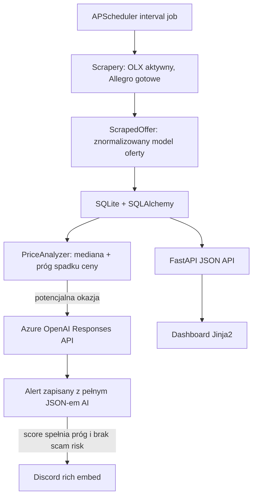

<div align="center">

# Deal Hunter

### Inteligentny monitor marketplace'ów, który wyszukuje niedoszacowane oferty zanim znikną.

Deal Hunter skanuje polskie platformy ogłoszeniowe, buduje historię cen dla
kategorii, wykrywa oferty poniżej mediany rynkowej, ocenia je przez Azure
OpenAI i wysyła najlepsze okazje na Discorda.


</div>

## Pomysł

Na marketplace'ach dobre oferty znikają szybko. Jednocześnie wyniki wyszukiwania
są pełne duplikatów, akcesoriów, uszkodzonych urządzeń, podejrzanych ogłoszeń i
szumu. Deal Hunter zamienia ten chaos w automatyczny pipeline decyzyjny:

1. Pobiera świeże oferty ze skonfigurowanych kategorii.
2. Zapisuje każdą próbkę ceny w lokalnej bazie.
3. Porównuje nowe ogłoszenia z medianą ceny w danej kategorii.
4. Przekazuje podejrzanie tanie oferty do LLM-a.
5. Ocenia jakość okazji, ryzyko scamu i rekomendowaną akcję.
6. Wysyła tylko sensowne alerty na Discorda.
7. Udostępnia wszystko w lokalnym dashboardzie FastAPI.

Projekt jest portfolio-ready, ale ma rozwiązania typowe dla prawdziwej aplikacji:
deduplikację, retry, trwałą konfigurację, strukturyzowane odpowiedzi AI,
regulowane progi, testy i wyraźnie oddzielone moduły.

## Przepływ Demo

```text
URL kategorii OLX
      |
      v
Async scraper -> znormalizowana oferta -> historia SQLite -> analiza mediany
                                                              |
                                                              v
                                                 ocena ryzyka przez Azure OpenAI
                                                              |
                                                              v
                                             alert Discord + wpis w dashboardzie
```

Dashboard lokalny działa pod adresem:

```text
http://127.0.0.1:8000/
```

Z dashboardu można dodawać obserwowane kategorie OLX, ustawiać zakresy cen,
konfigurować filtry include/exclude, uruchamiać skan ręcznie i przeglądać
najnowsze alerty.

## Najważniejsze Elementy Portfolio

| Obszar | Implementacja |
| --- | --- |
| Async scraping | `httpx`, `BeautifulSoup4`, rate limiting, retry backoff |
| Abstrakcja marketplace'ów | wspólny `BaseScraper` i model `ScrapedOffer` |
| Analiza cen | mediana per kategoria liczona z historycznych próbek |
| Warstwa AI | Azure OpenAI Responses API ze zwrotem JSON |
| Scam filtering | model zwraca score, sygnały scamu, stan, opis i akcję |
| Persistence | SQLAlchemy 2.0: oferty, historia cen, alerty, kategorie |
| Automatyzacja | APScheduler + endpoint ręcznego skanu |
| Dashboard | FastAPI + Jinja2 do kategorii i alertów |
| Powiadomienia | Discord webhook z rich embedami |
| Testy | pytest, in-memory SQLite i mockowany klient AI |

## Funkcje

- Cykliczne skanowanie OLX na podstawie kategorii zarządzanych z dashboardu.
- Integracja Allegro przygotowana przez OAuth2 device-code flow.
- Konfigurowalne progi cenowe, minimalna liczba próbek i próg alertów AI.
- Filtry include/exclude ograniczające szum w szerokich kategoriach.
- Deduplikacja ofert po `platform + external_id`.
- Zapisywanie decyzji AI nawet wtedy, gdy alert nie trafia na Discorda.
- Endpoint `scan now` do ręcznych testów i demo.
- JSON API dla health, stats, offers, alerts, settings i categories.
- Lokalna baza SQLite z lekką migracją kolumn filtrów kategorii.
- Rotujące logi przez `loguru`.

## Architektura



## Struktura Repozytorium

```text
deal-hunter/
├── analyzer/
│   ├── ai_analyzer.py          # ocena ofert przez Azure OpenAI i parsing JSON
│   └── price_analyzer.py       # wykrywanie okazji na podstawie mediany
├── api/
│   └── routes.py               # dashboard + JSON API
├── config/
│   ├── .env.example            # szablon sekretów
│   ├── __init__.py             # loader YAML + env
│   └── settings.yaml           # interwały, progi, seed kategorii
├── database/
│   ├── db.py                   # engine, sesje, init, lekka migracja
│   └── models.py               # Offer, PriceHistory, Alert, WatchCategory
├── notifier/
│   └── discord.py              # rich embedy Discorda
├── scheduler/
│   └── jobs.py                 # end-to-end scan pipeline
├── scrapers/
│   ├── allegro.py              # klient Allegro REST API
│   ├── allegro_auth.py         # OAuth2 device-code auth + refresh
│   ├── base.py                 # interfejs scrapera + dataclass ScrapedOffer
│   └── olx.py                  # scraper OLX i filtry keywordów
├── templates/
│   └── dashboard.html          # lokalny dashboard
├── tests/
│   ├── conftest.py             # fixture in-memory SQLite
│   ├── test_ai_analyzer.py
│   └── test_price_analyzer.py
├── auth_allegro.py             # jednorazowa autoryzacja Allegro
├── main.py                     # entrypoint aplikacji
├── requirements.txt
└── README.md
```

## Tech Stack

| Warstwa | Technologie |
| --- | --- |
| Runtime | Python 3.12+ |
| API | FastAPI, Uvicorn |
| UI | Jinja2, vanilla JavaScript |
| Scraping | httpx, BeautifulSoup4, tenacity |
| Baza danych | SQLite, SQLAlchemy 2.0 |
| AI | Azure OpenAI, Responses API |
| Joby | APScheduler |
| Konfiguracja | pydantic-settings, python-dotenv, YAML |
| Powiadomienia | Discord webhooks |
| Testy | pytest, pytest-asyncio |
| Logowanie | loguru |

## Jak To Działa

### 1. Scraping

`OlxScraper` pobiera aktywne kategorie z bazy danych, odpyta strony listingowe
przez `httpx`, parsuje server-rendered HTML przez BeautifulSoup, wyciąga realne
adresy obrazków z OLX CDN, stosuje zakresy cen i filtry keywordów, a następnie
zwraca znormalizowane obiekty `ScrapedOffer`.

### 2. Persistence

Pipeline zapisuje tylko nowe oferty, ale każda zaobserwowana cena trafia jako
próbka `PriceHistory`. Dzięki temu wykrywanie okazji opiera się na lokalnych
danych rynkowych, a nie na sztywnych, ręcznie wpisanych oczekiwaniach.

### 3. Analiza Ceny

`PriceAnalyzer` liczy medianę dla kategorii i flaguje ofertę tylko wtedy, gdy:

```text
price <= median * (1 - price_drop_threshold_pct)
```

Analyzer czeka też na `min_history_samples`, więc pierwsze skany nie generują
losowych alertów na podstawie zbyt małej liczby danych.

### 4. Ocena AI

Oflagowane oferty trafiają do Azure OpenAI ze ścisłym kontraktem JSON:

```json
{
  "score": 8,
  "is_scam_risk": false,
  "scam_indicators": [],
  "condition_assessment": "Dobry stan na podstawie treści ogłoszenia",
  "summary_pl": "Krótka polska rekomendacja dla kupującego.",
  "recommended_action": "buy"
}
```

Aplikacja ogranicza score do zakresu 1-10, usuwa ewentualne markdown fences,
odrzuca niepoprawny JSON, zapisuje surową odpowiedź modelu i wysyła alert na
Discorda tylko wtedy, gdy wynik spełnia skonfigurowany próg.

### 5. Alerty

Discord embed zawiera cenę, medianę kategorii, platformę, kategorię, score AI,
rekomendowaną akcję, kontekst sprzedawcy/lokalizacji, podsumowanie oraz miniaturę
oferty, jeśli jest dostępna.

## Quick Start

```bash
git clone git@github.com:MatteoBarzotto/Deal_Hunter.git
cd Deal_Hunter
python -m venv .venv
source .venv/bin/activate
pip install -r requirements.txt
cp config/.env.example config/.env
```

Uzupełnij `config/.env`:

```env
AZURE_OPENAI_ENDPOINT=https://your-resource.openai.azure.com/
AZURE_OPENAI_API_KEY=your_azure_openai_key
AZURE_OPENAI_DEPLOYMENT=gpt-5-mini
DISCORD_WEBHOOK_URL=https://discord.com/api/webhooks/...
```

Uruchom aplikację:

```bash
python main.py
```

Otwórz dashboard:

```text
http://127.0.0.1:8000/
```

Uruchom jeden skan i zakończ:

```bash
SCAN_ONLY=1 python main.py
```

## Konfiguracja

Główne zachowanie aplikacji jest ustawiane w `config/settings.yaml`:

```yaml
scan_interval_minutes: 15
price_drop_threshold_pct: 0.15
min_history_samples: 3
ai_score_threshold: 6
offer_freshness_hours: 24
```

| Ustawienie | Znaczenie |
| --- | --- |
| `scan_interval_minutes` | Jak często scheduler skanuje aktywne źródła |
| `price_drop_threshold_pct` | Minimalna różnica względem mediany przed oceną AI |
| `min_history_samples` | Minimalna liczba próbek przed analizą mediany |
| `ai_score_threshold` | Minimalny score AI wymagany do alertu Discord |
| `offer_freshness_hours` | Maksymalny wiek oferty kwalifikującej się do alertu |

Przy pierwszym starcie kategorie OLX z `settings.yaml` są seedowane do bazy.
Później kategorie są zarządzane z dashboardu.

## API

| Metoda | Endpoint | Opis |
| --- | --- | --- |
| `GET` | `/api/health` | Health check |
| `GET` | `/api/settings` | Aktualne ustawienia aplikacji |
| `GET` | `/api/stats` | Liczba ofert, alertów i próbek cen |
| `GET` | `/api/offers` | Najnowsze zescrapowane oferty |
| `GET` | `/api/alerts` | Najnowsze alerty AI wraz z ofertami |
| `GET` | `/api/categories` | Obserwowane kategorie |
| `POST` | `/api/categories` | Utworzenie kategorii |
| `POST` | `/api/categories/{id}` | Aktualizacja kategorii |
| `POST` | `/api/categories/{id}/toggle` | Włączenie lub wyłączenie kategorii |
| `DELETE` | `/api/categories/{id}` | Usunięcie kategorii |
| `GET` | `/api/categories/{id}/preview` | Podgląd działania filtrów keywordów |
| `POST` | `/api/scan-now` | Uruchomienie skanu w tle |

Przykład:

```bash
curl http://127.0.0.1:8000/api/stats
```

## Wsparcie Allegro

Integracja Allegro jest zaimplementowana, ale domyślnie wyłączona, ponieważ
dostęp do `/offers/listing` może zależeć od typu aplikacji i poziomu weryfikacji
konta.

Jednorazowa autoryzacja:

```bash
python auth_allegro.py
```

Następnie włącz Allegro w `config/settings.yaml`:

```yaml
allegro:
  enabled: true
```

Tokeny są przechowywane lokalnie w `config/allegro_tokens.json` i odświeżane
automatycznie, gdy jest taka potrzeba.

## Testy

```bash
pytest
```

Pokryte zachowania:

- liczenie mediany per kategoria,
- obsługa zbyt małej liczby próbek,
- wykrywanie okazji na podstawie progu,
- odrzucanie cen zerowych i ujemnych,
- parsowanie JSON-a z AI,
- usuwanie markdown fences,
- ograniczanie score do zakresu,
- obsługa niepoprawnej odpowiedzi AI.

Testy AI korzystają z mockowanego klienta Azure OpenAI, więc test suite nigdy
nie odpytuje prawdziwego API.

## Odpowiedzialne Użycie

Projekt jest przeznaczony do celów edukacyjnych i portfolio. Używaj go lokalnie,
respektuj regulaminy marketplace'ów i `robots.txt`, unikaj nadmiernej liczby
requestów, nie omijaj mechanizmów kontroli dostępu i preferuj oficjalne API tam,
gdzie jest dostępne. Nie publikuj, nie sprzedawaj i nie redystrybuuj danych
pozyskanych z marketplace'ów.

## Bezpieczeństwo

Repozytorium ignoruje lokalne sekrety i artefakty runtime:

```text
config/.env
config/allegro_tokens.json
*.db
logs/
.venv/
__pycache__/
.pytest_cache/
```

Przed publicznym pushem warto sprawdzić:

```bash
git status --short
```

## Decyzje Inżynierskie

- **Mediana zamiast średniej**: ceny na marketplace'ach mają dużo skrajnych
  outlierów.
- **SQLite first**: proste lokalne uruchomienie, dobre demo portfolio i mały
  koszt operacyjny.
- **Watchlist zarządzany z dashboardu**: strojenie kategorii nie wymaga edycji
  kodu.
- **Strukturyzowany output modelu**: warstwa AI jest parsowana i walidowana, a
  nie traktowana jak luźny tekst.
- **Persist before notify**: każda decyzja jest audytowalna nawet wtedy, gdy
  Discord nie działa albo alert jest poniżej progu.
- **Małe moduły**: scraper, analyzer, notifier, API i scheduler mogą rozwijać
  się niezależnie.

## Roadmap

- Wykresy historii cen w dashboardzie.
- Paginacja i filtrowanie alertów oraz ofert.
- Notifier Telegram.
- Docker i docker-compose.
- Profil deploymentu na Postgres.
- CI pipeline dla testów i lintingu.
- Lepsze wykrywanie outlierów przez percentile bands.
- Tryb Playwright dla marketplace'ów mocno opartych o JavaScript.

## Disclaimer

Deal Hunter jest narzędziem wspierającym decyzję, a nie gwarancją, że oferta jest
bezpieczna lub opłacalna. Przed zakupem zawsze zweryfikuj sprzedawcę, regulamin
platformy, metodę płatności i szczegóły ogłoszenia.
