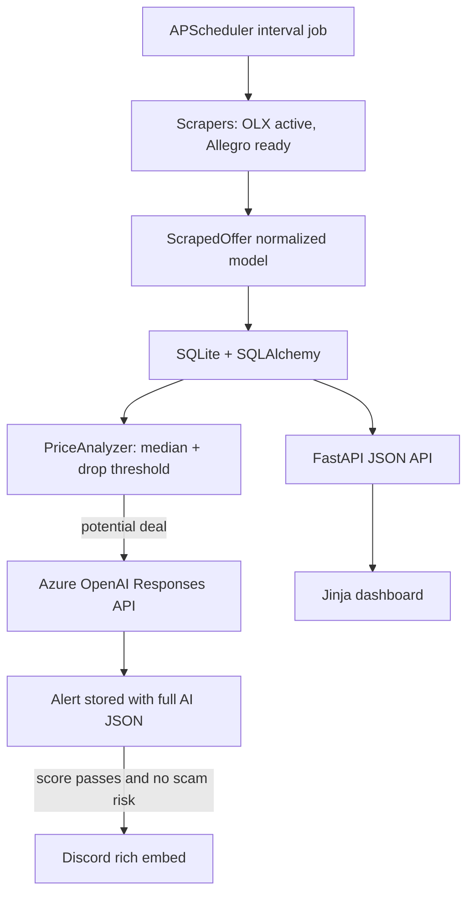

<div align="center">

# Deal Hunter

### AI marketplace monitor that finds underpriced offers before they disappear.

Deal Hunter scans Polish resale platforms, builds category-level price history,
detects listings below the market median, validates them with Azure OpenAI, and
sends high-confidence alerts to Discord.


</div>

## The Idea

Marketplaces move fast. Good offers are buried under duplicates, accessories,
scams, broken devices, and noisy search results. Deal Hunter turns that mess
into an automated decision pipeline:

1. Scrape fresh offers from configured categories.
2. Store every price sample in a local database.
3. Compare new listings against the category median.
4. Ask an LLM to evaluate deal quality and scam risk.
5. Send only useful alerts to Discord.
6. Keep everything inspectable in a FastAPI dashboard.

It is built as a portfolio project, but with production-style concerns:
deduplication, retries, persisted config, structured AI output, threshold tuning,
test coverage, and clear operational boundaries.

## Demo Flow

```text
OLX category URL
      |
      v
Async scraper -> normalized offer -> SQLite history -> median check
                                                       |
                                                       v
                                          Azure OpenAI risk scoring
                                                       |
                                                       v
                                      Discord alert + dashboard record
```

The local dashboard runs at:

```text
http://127.0.0.1:8000/
```

From there you can add watched OLX categories, set price ranges, configure
include/exclude keywords, trigger scans manually, and review recent alerts.

## Portfolio Highlights

| Capability | Implementation |
| --- | --- |
| Async scraping | `httpx`, `BeautifulSoup4`, rate limiting, retry backoff |
| Marketplace abstraction | shared `BaseScraper` interface and `ScrapedOffer` model |
| Price intelligence | per-category median calculation using historical samples |
| AI decision layer | Azure OpenAI Responses API with JSON object output |
| Scam filtering | model returns scam indicators, score, condition, summary and action |
| Persistence | SQLAlchemy 2.0 models for offers, price history, alerts and categories |
| Automation | APScheduler interval job with manual scan endpoint |
| Dashboard | FastAPI + Jinja2 admin view for categories and alerts |
| Notifications | Discord webhook rich embeds with offer metadata |
| Testing | pytest suite with in-memory SQLite and mocked AI client |

## Features

- Scheduled OLX scans from dashboard-managed category URLs.
- Allegro scraper integration prepared with OAuth2 device-code flow.
- Configurable price thresholds, sample requirements and alert score.
- Include/exclude keyword filters for reducing category noise.
- Duplicate offer protection using `platform + external_id`.
- AI alert persistence even when a Discord message is not sent.
- Manual `scan now` endpoint for local testing and demos.
- JSON API for health, stats, offers, alerts, settings and categories.
- Local SQLite database with lightweight schema migration for category filters.
- Rotating logs via `loguru`.

## Architecture



## Repository Structure

```text
deal-hunter/
├── analyzer/
│   ├── ai_analyzer.py          # Azure OpenAI scoring and JSON parsing
│   └── price_analyzer.py       # median-based deal detection
├── api/
│   └── routes.py               # dashboard + JSON API
├── config/
│   ├── .env.example            # secret template
│   ├── __init__.py             # YAML + env config loader
│   └── settings.yaml           # scan intervals, thresholds, seed categories
├── database/
│   ├── db.py                   # engine, sessions, init, lightweight migration
│   └── models.py               # Offer, PriceHistory, Alert, WatchCategory
├── notifier/
│   └── discord.py              # Discord rich embeds
├── scheduler/
│   └── jobs.py                 # end-to-end scan pipeline
├── scrapers/
│   ├── allegro.py              # Allegro REST API client
│   ├── allegro_auth.py         # OAuth2 device-code auth + refresh
│   ├── base.py                 # scraper interface + ScrapedOffer dataclass
│   └── olx.py                  # OLX scraper and keyword filters
├── templates/
│   └── dashboard.html          # local dashboard
├── tests/
│   ├── conftest.py             # in-memory SQLite fixture
│   ├── test_ai_analyzer.py
│   └── test_price_analyzer.py
├── auth_allegro.py             # one-time Allegro login helper
├── main.py                     # app entrypoint
├── requirements.txt
└── README.md
```

## Tech Stack

| Layer | Tools |
| --- | --- |
| Runtime | Python 3.12+ |
| API | FastAPI, Uvicorn |
| UI | Jinja2, vanilla JavaScript |
| Scraping | httpx, BeautifulSoup4, tenacity |
| Database | SQLite, SQLAlchemy 2.0 |
| AI | Azure OpenAI, Responses API |
| Jobs | APScheduler |
| Config | pydantic-settings, python-dotenv, YAML |
| Notifications | Discord webhooks |
| Tests | pytest, pytest-asyncio |
| Logging | loguru |

## How It Works

### 1. Scraping

`OlxScraper` reads enabled watch categories from the database, fetches listing
pages with `httpx`, parses server-rendered HTML with BeautifulSoup, extracts
real OLX CDN image URLs, applies price bounds and keyword filters, then returns
normalized `ScrapedOffer` objects.

### 2. Persistence

The scan pipeline inserts only new offers, while every observed price becomes a
`PriceHistory` sample. This keeps deal detection grounded in local market data
instead of hard-coded expectations.

### 3. Price Analysis

`PriceAnalyzer` calculates the category median and flags an offer only when:

```text
price <= median * (1 - price_drop_threshold_pct)
```

It also waits for `min_history_samples`, so early scans do not produce random
alerts from weak data.

### 4. AI Review

Flagged offers are sent to Azure OpenAI with a strict JSON contract:

```json
{
  "score": 8,
  "is_scam_risk": false,
  "scam_indicators": [],
  "condition_assessment": "Good condition based on listing text",
  "summary_pl": "Short Polish summary for the buyer.",
  "recommended_action": "buy"
}
```

The app clamps score values, strips occasional markdown fences, rejects invalid
JSON, stores the raw model response, and only sends Discord alerts when the
score threshold is met.

### 5. Alerting

Discord embeds include price, category median, platform, category, AI score,
recommended action, seller/location context, summary, and listing thumbnail when
available.

## Quick Start

```bash
git clone <your-repo-url>
cd deal-hunter
python -m venv .venv
source .venv/bin/activate
pip install -r requirements.txt
cp config/.env.example config/.env
```

Fill in `config/.env`:

```env
AZURE_OPENAI_ENDPOINT=https://your-resource.openai.azure.com/
AZURE_OPENAI_API_KEY=your_azure_openai_key
AZURE_OPENAI_DEPLOYMENT=gpt-5-mini
DISCORD_WEBHOOK_URL=https://discord.com/api/webhooks/...
```

Run the app:

```bash
python main.py
```

Open the dashboard:

```text
http://127.0.0.1:8000/
```

Run one scan and exit:

```bash
SCAN_ONLY=1 python main.py
```

## Configuration

Main behavior is controlled in `config/settings.yaml`:

```yaml
scan_interval_minutes: 15
price_drop_threshold_pct: 0.15
min_history_samples: 3
ai_score_threshold: 6
offer_freshness_hours: 24
```

| Setting | Meaning |
| --- | --- |
| `scan_interval_minutes` | How often the scheduler scans all enabled sources |
| `price_drop_threshold_pct` | Minimum discount below median before AI review |
| `min_history_samples` | Required number of price samples before median checks |
| `ai_score_threshold` | Minimum AI score required for Discord notification |
| `offer_freshness_hours` | Max age for offers eligible for alerting |

On first boot, OLX categories from `settings.yaml` are seeded into the database.
After that, categories are managed from the dashboard.

## API

| Method | Endpoint | Description |
| --- | --- | --- |
| `GET` | `/api/health` | Health check |
| `GET` | `/api/settings` | Effective app settings |
| `GET` | `/api/stats` | Offer, alert and price sample counts |
| `GET` | `/api/offers` | Recent scraped offers |
| `GET` | `/api/alerts` | Recent AI alerts with offer data |
| `GET` | `/api/categories` | Watched categories |
| `POST` | `/api/categories` | Create category |
| `POST` | `/api/categories/{id}` | Update category |
| `POST` | `/api/categories/{id}/toggle` | Enable or disable category |
| `DELETE` | `/api/categories/{id}` | Delete category |
| `GET` | `/api/categories/{id}/preview` | Preview keyword filter behavior |
| `POST` | `/api/scan-now` | Trigger scan in the background |

Example:

```bash
curl http://127.0.0.1:8000/api/stats
```

## Allegro Support

Allegro support is implemented but disabled by default because access to
`/offers/listing` can depend on application type and account verification.

Authorize once:

```bash
python auth_allegro.py
```

Then enable it in `config/settings.yaml`:

```yaml
allegro:
  enabled: true
```

Tokens are stored locally in `config/allegro_tokens.json` and automatically
refreshed when needed.

## Tests

```bash
pytest
```

Covered behavior:

- median calculation per category,
- insufficient-history handling,
- threshold-based deal detection,
- zero and negative price rejection,
- AI JSON parsing,
- markdown fence cleanup,
- score clamping,
- invalid AI response handling.

AI tests use a mocked Azure OpenAI client, so the test suite never calls the
real API.

## Responsible Use

This project is intended for educational and portfolio purposes. Use it locally,
respect marketplace Terms of Service and `robots.txt`, avoid excessive request
rates, do not bypass access controls, and prefer official APIs where available.
Do not publish, resell, or redistribute scraped marketplace data.

## Security

The repository ignores local runtime and secret files:

```text
config/.env
config/allegro_tokens.json
*.db
logs/
.venv/
__pycache__/
.pytest_cache/
```

Before publishing publicly, verify:

```bash
git status --short
```

## Engineering Decisions

- **Median over average**: marketplace prices contain extreme outliers.
- **SQLite first**: simple local setup, easy portfolio demo, low operational
  overhead.
- **Dashboard-managed watchlist**: category tuning does not require editing code.
- **Structured model output**: the AI layer is parsed and validated instead of
  treated as free text.
- **Persist before notify**: every decision is auditable even if Discord is down
  or the alert is below threshold.
- **Small composable modules**: scraper, analyzer, notifier, API and scheduler
  can evolve independently.

## Roadmap

- Price history charts in the dashboard.
- Pagination and filtering for alerts and offers.
- Telegram notifier.
- Docker and docker-compose setup.
- Postgres deployment profile.
- CI pipeline for tests and linting.
- More robust outlier handling using percentile bands.
- Playwright mode for JavaScript-heavy marketplaces.

## Disclaimer

Deal Hunter is a decision-support tool, not a guarantee that an offer is safe or
profitable. Always verify the seller, platform rules, payment method and listing
details before buying.
